

  

I'm planning to build a tool that helps people browse with less AI content or, if possible, remove it completely, including AI-generated summaries, videos, images and other features across the internet.

 As far as I know, the current tools out there that do this don't completely remove everything. So, let's try to build a better one, As a person who hates the bad effects of AI.

  

  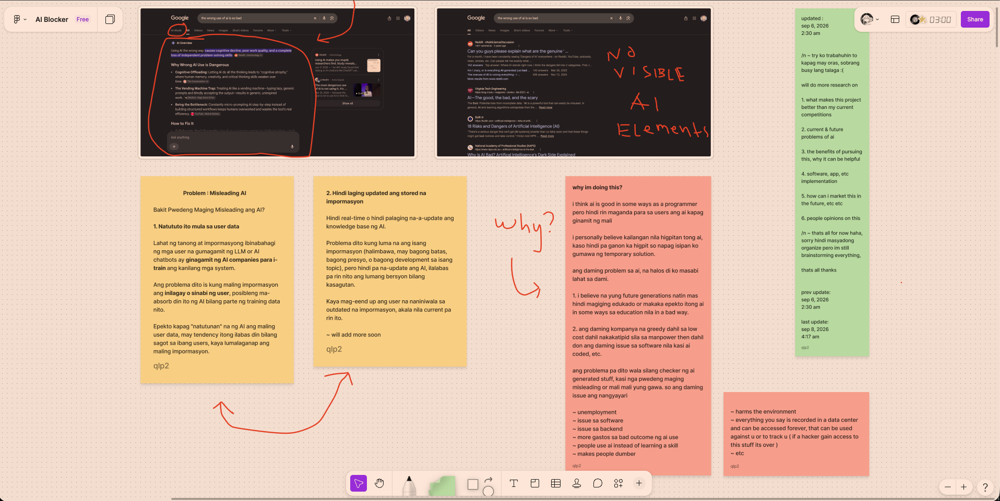

<h2 align="center">This is what I'm trying to remove</h2>

I'll expand this more in the future. (excuse the screenshots, im using blue light filter)

  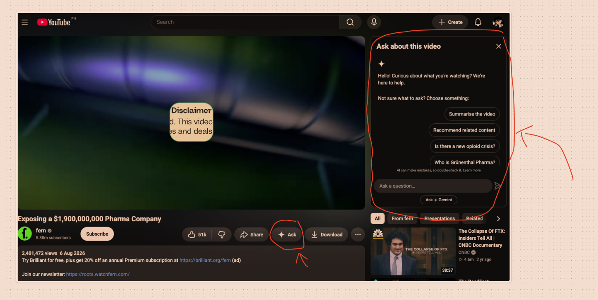

  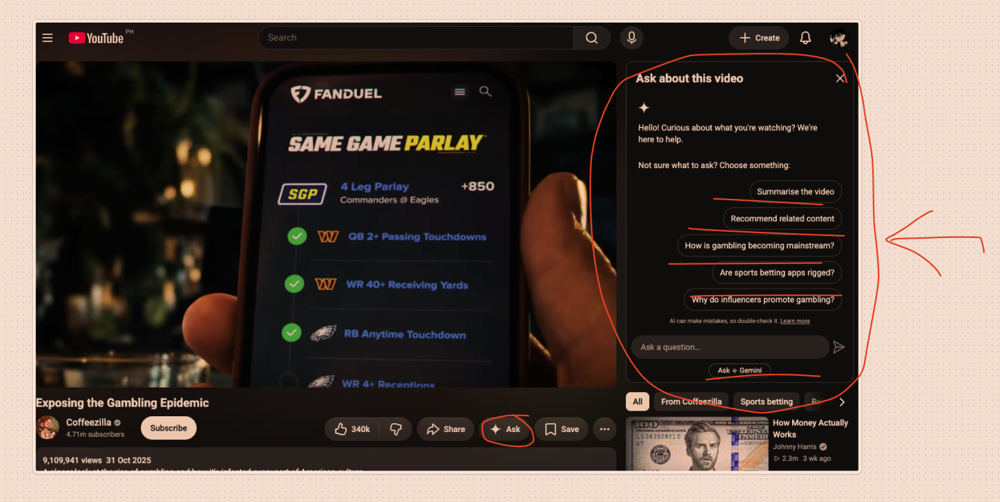

  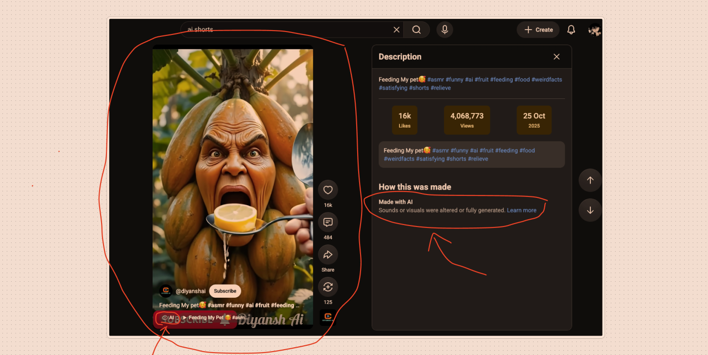

  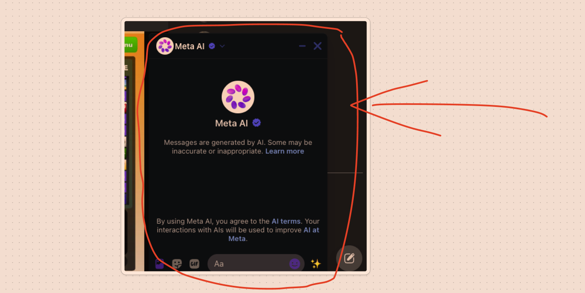

  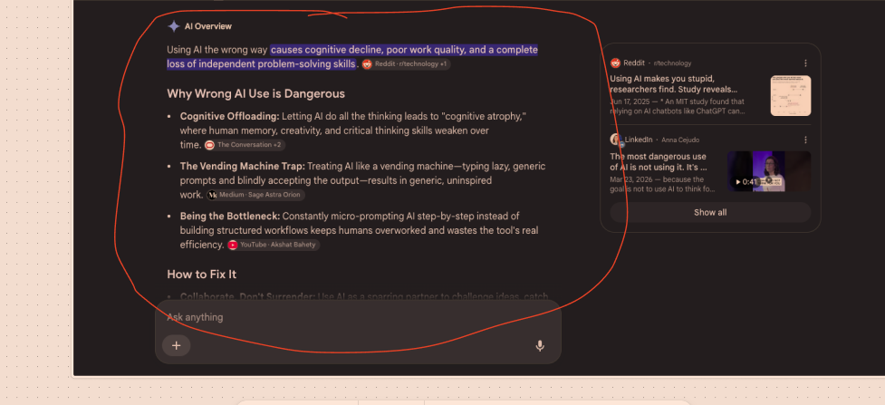

  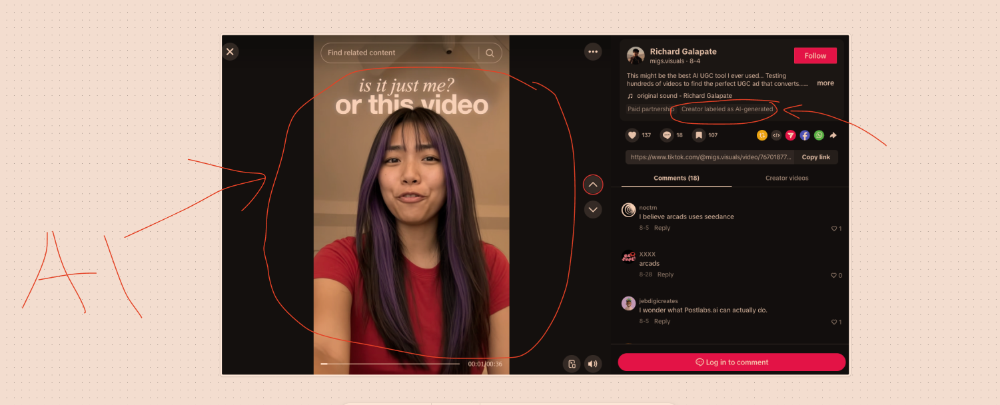

  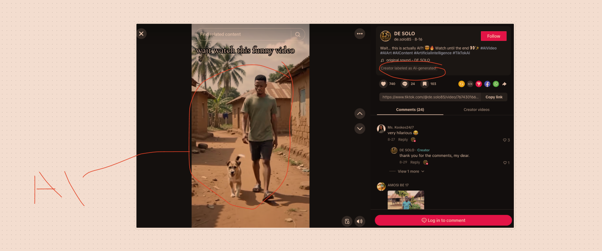

  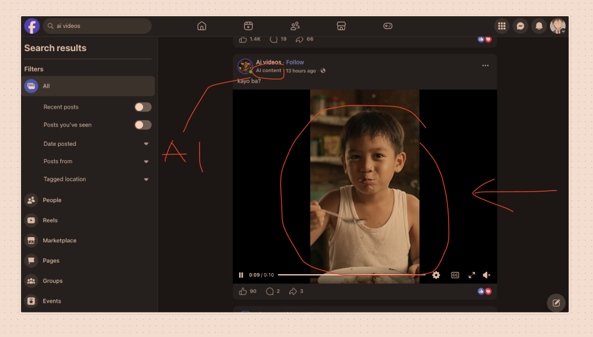

  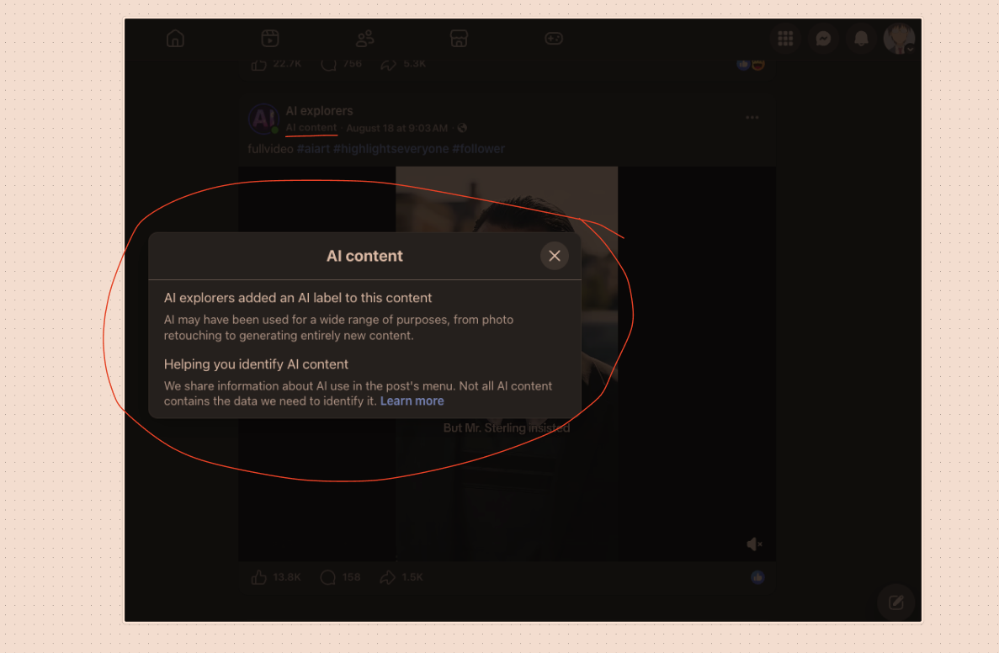

  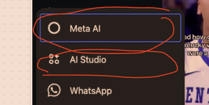

<!-- other-work-footer -->

Feel free to browse my other public projects on my repos

  <a href="https://github.com/marcdanielfalsado?tab=repositories">
    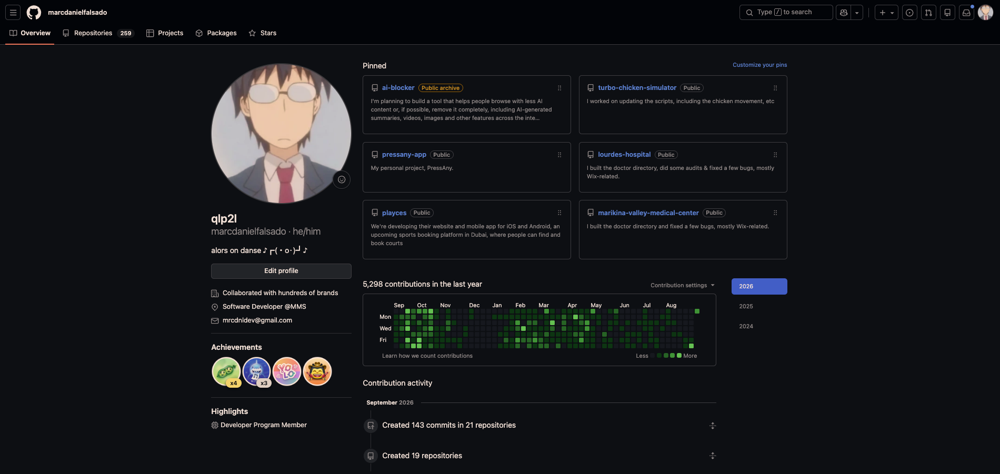
  </a>

and check my website aswell!

  

